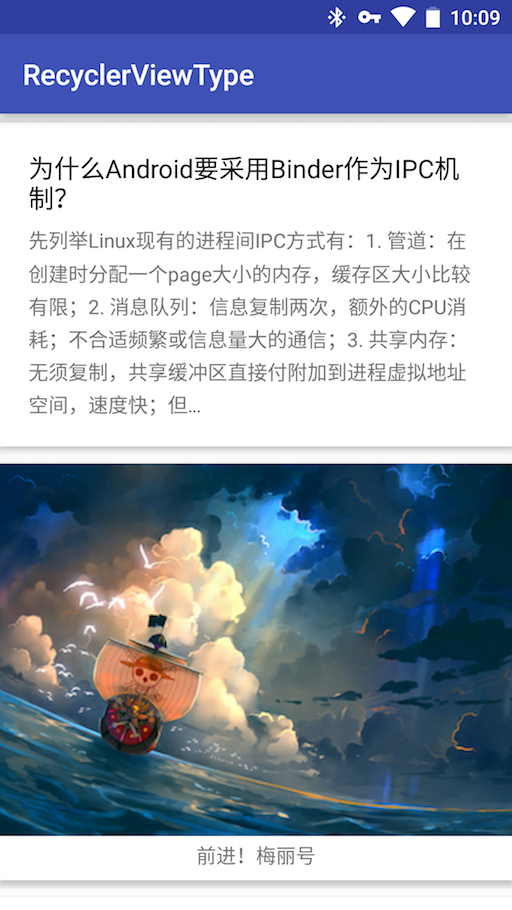

# RecyclerViewType

> 本项目只是 CommonAdapter 项目的一个功能的 demo，具体实现请移步项目 https://github.com/twiceyuan/CommonAdapter : )

[CommonAdapter](https://github.com/twiceyuan/CommonAdapter) 在 0.4 版本中加入了 RecyclerView 里 viewType 的支持，这里演示使用它借助 viewType 实现 RecyclerView 的多种布局。

## 如何使用？

```Java
// 定义
MultiTypeAdapter adapter = new MultiTypeAdapter(this);

// 注册 ViewType 类型（哪种数据使用哪种 ViewHolder）
adapter.registerViewType(Article.class, ArticleHolder.class);
adapter.registerViewType(Photo.class, PhotoHolder.class);

// 使用
recyclerView.setAdapter(adapter);
```

其中 ViewHolder 和 数据类型的定义方式：

1. 定义数据实体类 Article.java 

    ```java
    public class Article implement ViewTypeItem {
       public String title;
       public String content;
    }
    ```

2. 定义 ViewHolder 类 ArticleHolder.java

    ```java
    @LayoutId(R.layout.item_article)
    public class ArticleHolder extends CommonHolder<Article> {

        @ViewId(R.id.textTitle) public   TextView textTitle;
        @ViewId(R.id.textContent) public TextView textContent;
        
        @Override public void bindData(Article article) {
            textTitle.setText(article.title);
            textContent.setText(article.content);
        }
    }
    ```

## 截图

<p align="center">
  
</p>

## 主要原理

直接使用 RecyclerView 来实现 ViewType 时，需要做这样几件事：

1. 定义 N 种 ViewType 常量
2. 定义 N 个 ViewHolder（继承 RecyclerView.ViewHolder）
3. 在 OnCreateHolder 中重写创建 holder 的逻辑，也就是从 viewType 到 holder 的映射
4. 在 getItemViewType 中重写获得 ViewType 的逻辑，也就是从 item（实体）或者 position 到 viewType 的映射

在 CommonAdapter 中，对这个逻辑进行了简化，因为 viewType 的最终目的就是完成从实体或者位置到 Holder 的映射，所以在 CommonAdapter 中只需要做两件事：

1. 定义 N 种 ViewHolder（继承 CommonHolder<ViewTypeItem>）
2. 实现 ViewTypeMapper 接口（从 Item 或者 position 到 holder 的映射）

实现原理其实是使用了 viewHolder 的 class 对象的 hashCode 当做了 viewType，因为这样完全满足 ViewType 使用时的要求，又减少了多余的定义。

这里写了一个小例子，在一个 RecyclerView 中，有两种类型的数据，它们分别是文章（Article）和（照片）。它们分别使用不同的布局并且定了不同的 ViewHolder（这里继承的是 CommonHolder）
